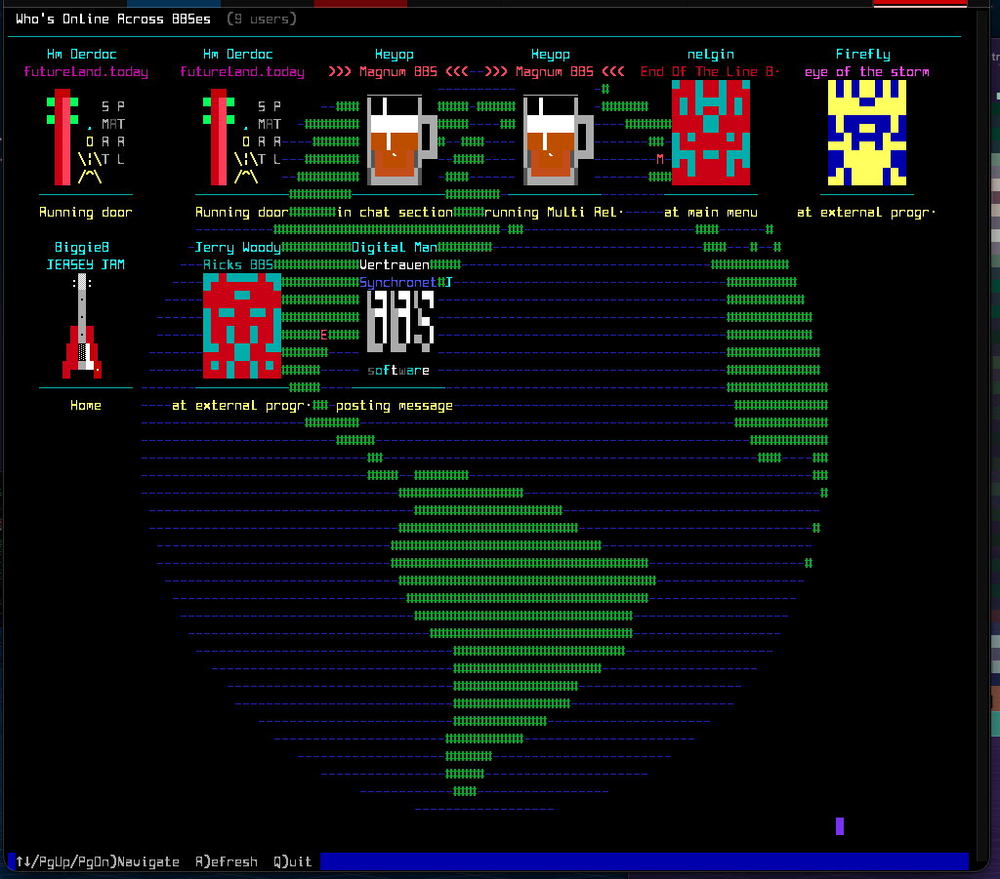

# Inter-BBS Who's Online Globe

A read-only Synchronet external program that displays active users across linked
BBSes in a tiled avatar grid over an animated ASCII globe. It includes local
terminal and web users, remote inter-BBS users, activity text, automatic
refreshes, and location markers when geographic hints are available.

## Install

Place this directory under your Synchronet `xtrn` directory and add
`ibbs-online.js` as an external program in SCFG. The door uses Synchronet's
standard `sbbsimsg_lib.js` and `avatar_lib.js` libraries.

## Controls

- `Up`, `Down`, `PgUp`, `PgDn`: navigate
- `R`: refresh
- `Q`: quit
